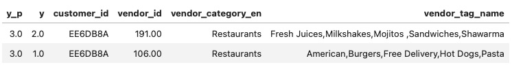

# Content-based Neural Network Recommendation System for Restaurants
## Overview
This project aimed to create a content-based recommendation system using a neural network algorithm for customers of `Akeed`, an app-based food delivery service. The system leveraged three datasets from [kaggle](https://www.kaggle.com/datasets/mrmorj/restaurant-recommendation-challenge):`train_customers.csv`, `orders.csv`, and `vendors.csv`. The recommendation system suggests restaurants to customers by identifying vendors that offer similar food or drinks to those previously purchased by the customers from other restaurants on the app. Additionally, the system has the potential to recommend restaurants to new users once it gathers information such as food preferences, gender, and location.
## Business Understanding
According to the ['Online Food Delivery Services Global Market Report 2020-30'](https://www.sciencedirect.com/science/article/abs/pii/S0278431922001025#:~:text=According%20to%20“Online%20Food%20Delivery,annual%20growth%20rate%20of%2011.51%25.), the global online food delivery market is rapidly growing, expected to reach $154.34 billion by 2023 with annual growth rate of 11.51%. Implementing a recommendation system can tap into this expanding market by enhancing user experience and operational efficiency. Additionally, online food delivery platforms that personalize the user experience [retain 80% of their customers](https://www.mckinsey.com/industries/technology-media-and-telecommunications/our-insights/the-changing-market-for-food-delivery), highlighting the importance of such systems in maintaining a strong user base​.

In summary, developing a recommendation system for Akeed not only aligns with its vision of being a leading delivery and discovery platform but also offers substantial benefits in terms of customer satisfaction, operational efficiency, and market competitiveness.
## Data Understanding
These datasets contained 131970 orders, 100 vendors, and 34528 customers. With feature engineering, customers' food preferences were extracted based on restaurants where they had previously placed an order in the app. 

