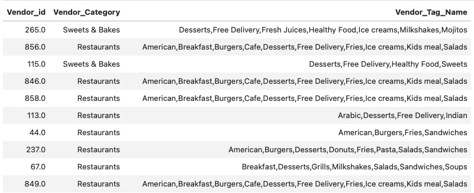

# Content-based Neural Network Recommendation System for Restaurants
## Overview
This project aimed to create a content-based recommendation system using a neural network algorithm for customers of `Akeed`, an app-based food delivery service. The system leveraged three datasets from [kaggle](https://www.kaggle.com/datasets/mrmorj/restaurant-recommendation-challenge): `train_customers.csv`, `orders.csv`, and `vendors.csv`. The recommendation system suggests restaurants to customers by identifying vendors that offer similar food or drinks to those previously purchased by the customers from other restaurants on the app. Additionally, the system can recommend restaurants to new users once it gathers information such as food preferences, gender, and location.
## Business Understanding
According to the ['Online Food Delivery Services Global Market Report 2020-30'](https://www.sciencedirect.com/science/article/abs/pii/S0278431922001025#:~:text=According%20to%20Online%20Food%20Delivery,annual%20growth%20rate%20of%2011.51%25.), the global online food delivery market is rapidly growing, expected to reach $154.34 billion by 2023 with annual growth rate of 11.51%. Implementing a recommendation system can tap into this expanding market by enhancing user experience and operational efficiency. Additionally, online food delivery platforms that personalize the user experience [retain 80% of their customers](https://www.mckinsey.com/industries/technology-media-and-telecommunications/our-insights/the-changing-market-for-food-delivery), highlighting the importance of such systems in maintaining a strong user base.

In summary, developing a recommendation system for Akeed aligns with its vision of being a leading delivery and discovery platform. It offers substantial customer satisfaction, operational efficiency, and market competitiveness benefits.
## Data Understanding
These datasets contained 131970 orders, 100 vendors, and 34528 customers. With feature engineering, customers' food preferences were extracted based on restaurants where they had previously placed an order in the app. 

For example, customer `EE6DB8A` placed an order with vendor `191` and purchased 2 items, as shown in the `y` column. Hence, this customer has food preferences for Fresh Juices, Milkshakes, Mojitos, Sandwiches, and Shawarma. The `y_p` column represents the predicted item count by the recommendation system for customer `EE6DB8A`.
## [Modeling and Evaluation](Restaurant_Recommendation_System.ipynb)
Using the neural network algorithm, a content-based recommendation system was built. The neural network above produces two feature vectors: a user feature vector and a vendor feature vector. These are 32 entry vectors whose values are difficult to interpret. However, similar vendors will have similar vectors. This information can be used to make recommendations. From the above example, customer `EE6DB8A` bought from vendor `191`, and one could recommend similar vendors by selecting vendors with similar vendor feature vectors as shown in table below.

## Conclusion
Although our current recommendation system might need some fine-tuning, it effectively helps existing customers discover new restaurants by suggesting vendors that sell similar food and drinks to their previous orders. By meticulously crafting customer profiles based on their food preferences, gender, and location, we’ve trained a neural network to personalize recommendations. This ensures that even new users receive tailored suggestions right from the start. To make this possible, we’ll need to collect key information from new users during the registration process, perhaps through a simple survey.

This approach not only enhances the user experience but also aligns perfectly with Akeed's vision of being a top-notch delivery and discovery platform. By continually improving the system, we can keep boosting user satisfaction, increasing order frequency, and maintaining a competitive edge in the rapidly growing food delivery market. Overall, our recommendation system stands as a promising tool for meeting the evolving needs of our customers and partners, making Akeed a preferred choice for food delivery.
